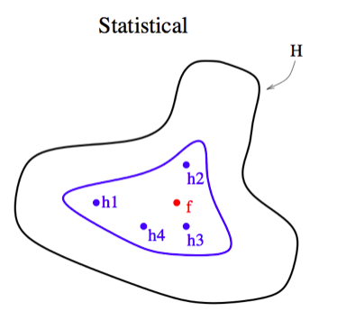
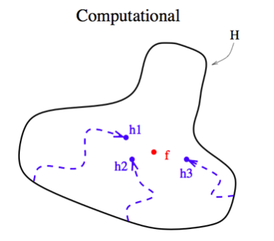
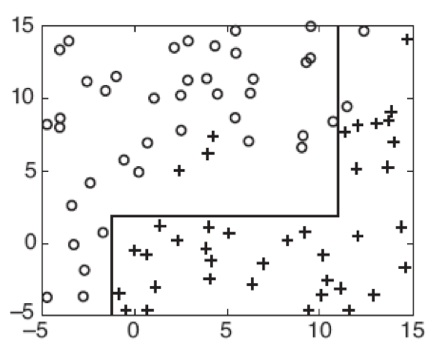
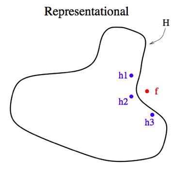
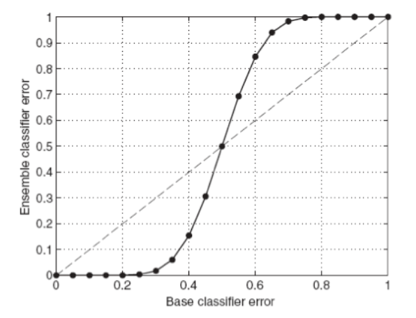

#  Ensemble Methods - Decision Trees and Bagging
Week 6 | Lesson 2.3

### LEARNING OBJECTIVES
*After this lesson, you will be able to:*
- Explain the power of using ensemble classifiers
- Know the difference between a base classifier and an ensemble classifier
- Describe how bagging works
- Use the bagging classifier in scikit-learn

### STUDENT PRE-WORK
*Before this lesson, you should already be able to:*
- Perform a classification
- Use label encoder
- Use cross validation to evaluate model performance

### INSTRUCTOR PREP
*Before this lesson, instructors will need to:*
- Read in / Review any dataset(s) & starter/solution code
- Generate a brief slide deck
- Prepare any specific materials
- Provide students with additional resources

### LESSON GUIDE


<a name="opening"></a>
## Opening (10 min)

In the previous lectures we learned about Decision Trees, APIs and SQL Joins: many different techniques that combined together give us powerful tools to analyze and process data. Today we will learn about ensemble techniques: ways to combine different models in order to obtain a more powerful model.

Before we dive into the subject, let's recap a few things learned so far:

**Check:** What classifiers have we learned about so far? Which one is your favourite?

**Check:** How did we assess the "goodness" of a particular model?

**Check:** Any idea on how we could improve the performance of a model?

<a name="introduction"></a>
## Introduction: Ensemble Techniques (30 min)

### Ensembles
Ensemble techniques are supervised learning methods to improve predictive accuracy by combining several base models in order to enlarge the space of possible hypothesis to represent our data. Ensembles are often much more accurate than the base classifiers that compose them.

**Check:** Short discussion:
- When this might be useful?
- Can you think of a business case where we may want to get a very very accurate model (despite it being more complex)

Two families of ensemble methods are usually distinguished:

- In averaging methods, the driving principle is to build several estimators independently and then to average their predictions. On average, the combined estimator is usually better than any of the single base estimator because its variance is reduced.

Examples of this family include Bagging methods and Random Forest.

- The other family of ensemble methods are boosting methods, where base estimators are built sequentially and one tries to reduce the bias of the combined estimator. The motivation is to combine several weak models to produce a powerful ensemble. We will discuss these in a future lecture.

Examples of this family include AdaBoost and Gradient Tree Boosting.


### The Hypothesis space

In any supervised learning task, our goal is to make predictions of the true classification function $f$ by learning the classifier $h$. In other words we are searching in a certain hypothesis space for the most appropriate function to describe the relationship between our features and the target.

**Check:** Can you give an example of how this search is performed using one of the classifiers you know?

**Check:** What reasons could be preventing our hypothesis to reach perfect score?

There could be several reasons why a base classifier doesn't perform terribly well in trying to approximate the true classification function. These are of three types:
- Statistical
- Computational
- Representational


#### The Statistical Problem
If the amount of training data available is small, the base classifier will have difficulty converging to $h$.

An ensemble classifier can mitigate this problem by "averaging out" base classifier predictions to improve convergence. This can be pictorially represented as a search in a space where multiple partial perspectives are combined to obtain a better picture of the goal.



(source: http://www.cs.iastate.edu/~jtian/cs573/Papers/Dietterich-ensemble-00.pdf)

The true function $f$ is best approximated as an average of the base classifiers.

**Check:** How would you re-phrase the statistical problem?

#### The Computational Problem
Even with sufficient training data, it may still be computationally difficult to find the best classifier $h$.

For example, if our base classifier is a decision tree, an exhaustive search of the hypothesis space of all possible classifiers is extremely complex (NP-complete).

In fact this is why we used a heuristic algorithm (greedy search).

An ensemble composed of several _Base Classifiers_’s with different starting points can provide a better approximation to $f$ than any individual _Base Classifiers_.



The true function $f$ is often best approximated by using several starting points to explore the hypothesis space.

**Check:** How would you re-phrase the computational problem?

#### The Representational Problem
Sometimes $f$ cannot be expressed in terms of our hypothesis at all. To illustrate this, suppose we use a decision tree as our base classifier. A decision tree works by forming a rectilinear partition of the feature space, i.e it always cuts at a fixed value along a feature.



But what if $f$ is a diagonal line?

Then it cannot be represented by finitely many rectilinear segments, and therefore the true decision boundary cannot be obtained by a decision tree classifier.

However, it may be still be possible to approximate $f$ or even to expand the space of representable functions using ensemble methods.



**Check:** How would you re-phrase the representational problem?

### Characteristics of Ensemble methods

In order for an ensemble classifier to outperform a single base classifier, the following conditions must be met:

- **accuracy**: base classifiers outperform random guessing
- **diversity**: misclassifications must occur on different training examples

**Check:** What base classifiers would you combine to have different perspectives?





<a name="guided-practice"></a>
## Guided Practice: Find real world uses of ensemble methods (20 min)

There are many examples of real-world uses of ensemble methods, the most famous one probably being the Netflix prize.

In small groups of 3-4 people look for one or two real world applications of ensemble methods and then choose your favourite one to report to the class.

Here are some sources to start your search:

- [Kaggle comptetitions](https://www.kaggle.com/competitions)
- [Review Paper](http://www.sciencedirect.com/science/article/pii/S1566253507000620)
- [KDNuggets article 1](http://www.kdnuggets.com/2016/02/ensemble-methods-techniques-produce-improved-machine-learning.html)
- [KDNuggets article 2](http://www.kdnuggets.com/faq/simple-data-mining-case-study.html)
- [Ensemble Methods book](http://www.amazon.com/dp/1608452840)


<a name="introduction_2"></a>
## Introduction: Bagging (10 min)

_Bagging or bootstrap aggregating_ is a method that involves manipulating the training set by resampling. We learn $k$ base classifiers on $k$ different samples of training data.  These samples are independently created by resampling the training data using uniform weights (e.g. a uniform sampling distribution). In other words each model in the ensemble votes with equal weight. In order to promote model variance, bagging trains each model in the ensemble using a randomly drawn subset of the training set. As an example, the random forest algorithm combines random decision trees with bagging to achieve very high classification accuracy.

|Original|1|2|3|4|5|6|7|8|
|----|----|----|----|----|----|----|----|----|
|Training set 1|2|7|8|3|7|6|3|1|
|Training set 2|7|8|5|6|4|2|7|1|
|Training set 3|3|6|2|7|5|6|2|2|
|Training set 4|4|5|1|4|6|4|3|8|

Given a standard training set $D$ of size $n$, bagging generates $m$ new training sets $D_i$, each of size $n'$, by sampling from $D$ uniformly and with replacement. By sampling with replacement, some observations may be repeated in each $D_i$. The $m$ models are fitted using the above $m$ samples and combined by averaging the output (for regression) or voting (for classification).

Bagging reduces the variance in our generalization error by aggregating multiple base classifiers together (provided they satisfy our earlier requirements).

If the base classifier is stable then the ensemble error is primarily due to bias, and bagging may not be effective.

Since each sample of training data is equally likely, bagging is not very susceptible to overfitting with noisy data.

As they provide a way to reduce overfitting, bagging methods work best with strong and complex models (e.g., fully developed decision trees), in contrast with boosting methods which usually work best with weak models (e.g., shallow decision trees).

**Check:** Can you propose another sample to add to those above? Call out the numbers you would include.

<a name="demo"></a>
## Demo: Bagging Classifier in Scikit Learn (15 min)

In scikit-learn, bagging methods are offered as a unified `BaggingClassifier` meta-estimator (resp. `BaggingRegressor`), taking as input a user-specified base estimator along with parameters specifying the strategy to draw random subsets. In particular, `max_samples` and `max_features` control the size of the subsets (in terms of samples and features), while `bootstrap` and `bootstrap_features` control whether samples and features are drawn with or without replacement. When using a subset of the available samples the generalization error can be estimated with the out-of-bag samples by setting `oob_score=True`.

As an example, we will compare the performance of a simple KNN classifier versus the Bagging Classifier on the car acceptability dataset.

The first step is to load the data into Pandas. Do it on your own:
- Import pandas
- Load the data from a csv file

> Solution:
>
    import pandas as pd
    df = pd.read_csv('./assets/datasets/car.csv')


```python
df.head()
```


<div>
<table border="1" class="dataframe">
  <thead>
    <tr style="text-align: right;">
      <th></th>
      <th>buying</th>
      <th>maint</th>
      <th>doors</th>
      <th>persons</th>
      <th>lug_boot</th>
      <th>safety</th>
      <th>acceptability</th>
    </tr>
  </thead>
  <tbody>
    <tr>
      <th>0</th>
      <td>vhigh</td>
      <td>vhigh</td>
      <td>2</td>
      <td>2</td>
      <td>small</td>
      <td>low</td>
      <td>unacc</td>
    </tr>
    <tr>
      <th>1</th>
      <td>vhigh</td>
      <td>vhigh</td>
      <td>2</td>
      <td>2</td>
      <td>small</td>
      <td>med</td>
      <td>unacc</td>
    </tr>
    <tr>
      <th>2</th>
      <td>vhigh</td>
      <td>vhigh</td>
      <td>2</td>
      <td>2</td>
      <td>small</td>
      <td>high</td>
      <td>unacc</td>
    </tr>
    <tr>
      <th>3</th>
      <td>vhigh</td>
      <td>vhigh</td>
      <td>2</td>
      <td>2</td>
      <td>med</td>
      <td>low</td>
      <td>unacc</td>
    </tr>
    <tr>
      <th>4</th>
      <td>vhigh</td>
      <td>vhigh</td>
      <td>2</td>
      <td>2</td>
      <td>med</td>
      <td>med</td>
      <td>unacc</td>
    </tr>
  </tbody>
</table>
</div>

Since most of the features are categorical text we will need to encode them as numbers using the `LabelEncoder`:


```python
from sklearn.preprocessing import LabelEncoder
le = LabelEncoder()
features = [c for c in df.columns if c != 'acceptability']
for c in df.columns:
    df[c] = le.fit_transform(df[c])

X = df[features]
y = df['acceptability']
```

Notice that we overwrote the original features for simplicity, since we are not interested in doing a study on feature importance.

**Check:** Is it correct to use the label encoder blindly like this?
> Answer: no, it's not correct, because the categorical features have a scale. It would be more appropriet to do one of the following:
- either use pd.get_dummies to encode them as binaries
- use a map that correctly assigns a numerical scale to the values, e.g. where med > small

The next step is to calculate the `cross_val_score` on the two classifier:


```python
from sklearn.cross_validation import cross_val_score
from sklearn.ensemble import BaggingClassifier
from sklearn.neighbors import KNeighborsClassifier

knn = KNeighborsClassifier()
bagging = BaggingClassifier(knn, max_samples=0.5, max_features=0.5)

print "KNN Score:\t", cross_val_score(knn, X, y, cv=5, n_jobs=-1).mean()
print "Bagging Score:\t", cross_val_score(bagging, X, y, cv=5, n_jobs=-1).mean()
```

    KNN Score:	0.643070305149
    Bagging Score:	0.722795402608


**Check:** Does bagging interfere with grid search? Are we leaking data and thus faking the cross val score?
> Answer: We are not leaking data. Bagging acts on the training sample for each fold, so it is not aware of the data in the test fold. You can convince yourself of this by doing a simple train test split

### Bagging Classifier details

The `BaggingClassifier` meta-estimator has several parameters.

**Check:** In pairs, look at the [documentation](http://scikit-learn.org/stable/modules/generated/sklearn.ensemble.BaggingClassifier.html) for a detailed description of each and find out what `max_samples` and `max_features` do.


<a name="ind-practice"></a>
## Independent Practice (10 min)

Take a dataset of your choice and practice comparing the score of a base classifier with the bagging classifier. Explore also the effect of changing one or more parameters.

For example could use one of the dataset of the `week5/5.2-lab` or any other dataset of your choice.

<a name="conclusion"></a>
## Conclusion (5 min)

Today we have learned about Ensemble Models and Bagging Classifier. We have learned how they improve the performance of individual base models thanks to their better ability to approximate the real prediction function in a supervised learning problem.

**Check:** Which of the 3 problems does a bagging classifier solve?
> Answer: all three

### ADDITIONAL RESOURCES

- [Ensemble models on wikipedia](https://en.wikipedia.org/wiki/Ensemble_learning)
- [Bagging on wikipedia](https://en.wikipedia.org/wiki/Bootstrap_aggregating)
- [Ensemble methods on Scikit Learn](http://scikit-learn.org/stable/modules/ensemble.html)
- [Bagging Classifier documentation](http://scikit-learn.org/stable/modules/generated/sklearn.ensemble.BaggingClassifier.html)
- [Bias Varias Decomposition Scikit Learn Example](http://scikit-learn.org/stable/auto_examples/ensemble/plot_bias_variance.html#example-ensemble-plot-bias-variance-py)
